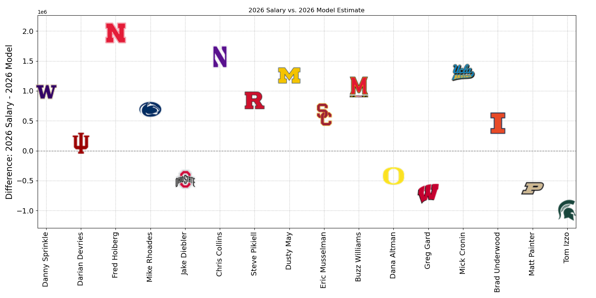
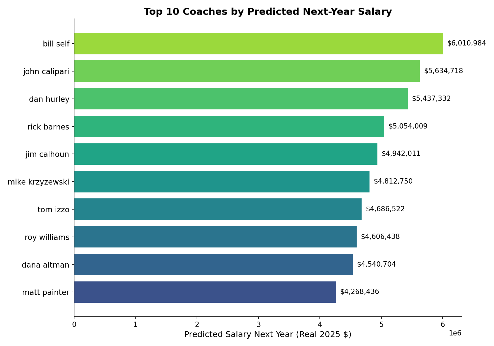
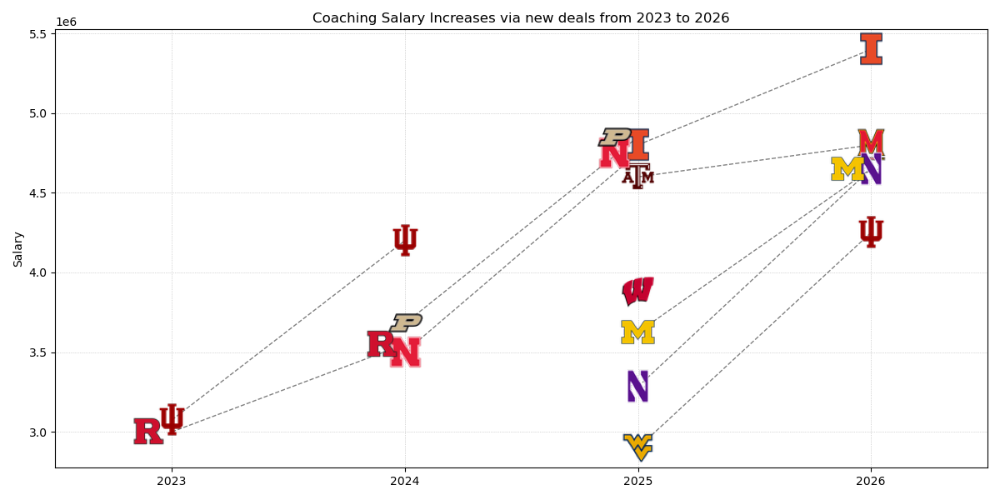
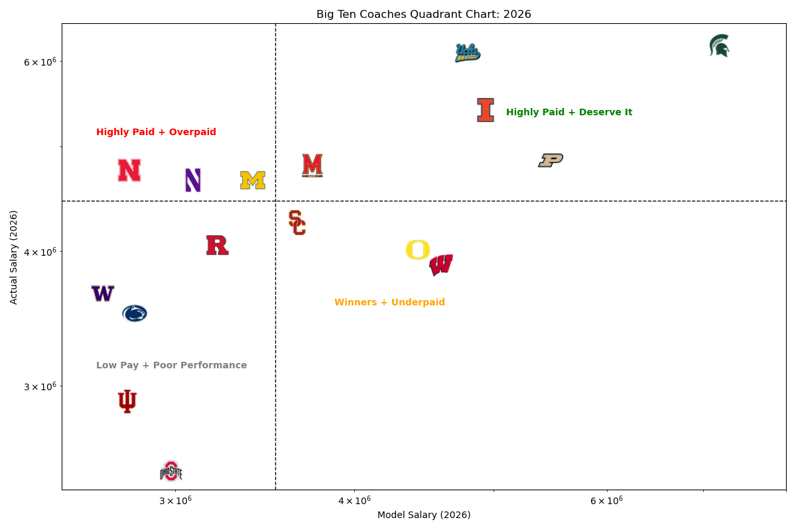

# College Basketball Coach Compensation Model

## Overview

This project builds a **data-driven salary valuation model** for NCAA Division I basketball coaches, estimating what a coach *should* be paid based on performance, experience, and market conditions.

The system integrates historical performance data, salary records, and financial context to identify **overpaid and underpaid coaches**, with a primary case study on Big Ten programs.

---

## Key Skills Demonstrated

- Large-scale data aggregation & cleaning
- Feature engineering (career + rolling metrics)
- Regression modeling & validation
- Economic / market-based modeling
- Data storytelling & visualization

---

## Core Question

> What is a coach’s fair market salary given their performance and context?

---

## Dataset

- **28,000+ coach-season records**
- **3,800+ coaches**
- **75 conferences**
- Compensation data, performance metrics, and revenue context

---

## Methodology

### 1. Data Pipeline
- Scraped Sports Reference (team + coach data)
- Scraped USA Today compensation data
- Financial data from the Knight-Newhouse College Athletics Database
- Merged datasets across inconsistent naming systems
- Built unified coach-season dataset

---

### 2. Feature Engineering

Created 190+ features including:

- Career performance:
  - win %
  - NCAA appearances
  - tournament success
- Rolling performance (5-year windows)
- Conference strength + revenue
- Inflation-adjusted salary metrics

---

### 3. Modeling Approach

- ElasticNet / Lasso-style regression
- Log-transformed salary target
- Year-based normalization (z-scoring)
- GroupKFold validation (by coach)

Model performance:
- Cross-validated R² ≈ 0.51

---

## Key Outputs

- Predicted salary vs actual salary
- Over/underpayment rankings
- Conference-level salary comparisons
- Market-adjusted compensation estimates

---

## Example Visualizations

### Salary vs Model Estimate - Big Ten

### Top 10 Coaches by Predicted Salary - All Time

### Salary Growth Trends - Big Ten

### Quadrant Analysis - Big Ten

---

## Key Findings

- Salary is driven by both:
  - performance
  - **conference financial power**
- Significant inefficiencies exist in coach compensation
- Several high-performing coaches are systematically underpaid relative to market benchmarks

---

## Why This Project Matters

This project demonstrates the ability to:

- Build large, messy datasets from scratch  
- Design **market-based valuation models**  
- Apply statistical modeling to real-world economic problems  
- Communicate insights through clear visualizations  

---

## Limitations
 
- No fully automated pipeline (research-focused)  
- External data sources will change over time  

---

## Future Improvements

- Full pipeline automation
- API-based data ingestion
- Model deployment as a valuation tool
- Integration with real-time contract data

---

## Author

Isaac Gard  
MS Business Analytics — UW Madison  
